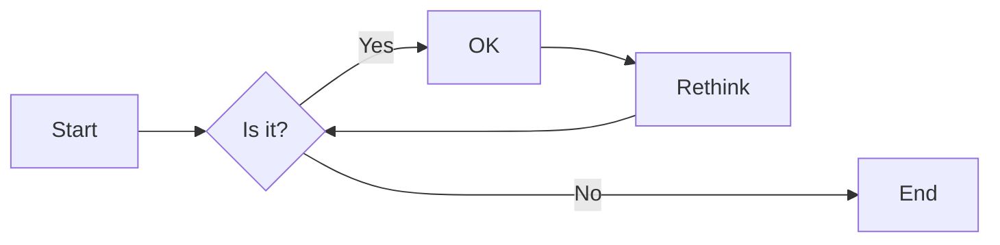
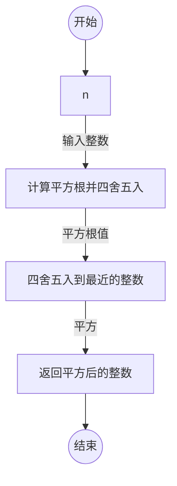
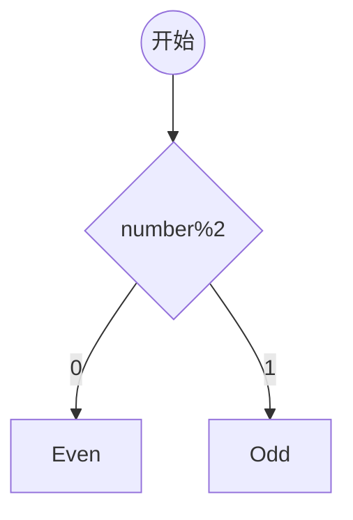

# 实验二 Python变量、简单数据类型

班级： 21计科4班

学号： B20210302426

姓名： 陈佩儿

Github地址：<https://github.com/shaliey/python_course>

CodeWars地址：<https://www.codewars.com/users/shaliey>

---

## 实验目的

1. 使用VSCode编写和运行Python程序
2. 学习Python变量和简单数据类型

## 实验环境

1. Git
2. Python 3.10
3. VSCode
4. VSCode插件

## 实验内容和步骤

### 第一部分

实验环境的安装

1. 安装Python，从Python官网下载Python 3.10安装包，下载后直接点击可以安装：[Python官网地址](https://www.python.org/downloads/)
2. 为了在VSCode集成环境下编写和运行Python程序，安装下列VScode插件
   - Python
   - Python Environment Manager
   - Python Indent
   - Python Extended
   - Python Docstring Generator
   - Jupyter
   - indent-rainbow
   - Jinja

---

### 第二部分

Python变量、简单数据类型和列表简介

完成教材《Python编程从入门到实践》下列章节的练习：

- 第2章 变量和简单数据类型

---

### 第三部分

在[Codewars网站](https://www.codewars.com)注册账号，完成下列Kata挑战：

---

#### 第1题：求离整数n最近的平方数（Find Nearest square number）

难度：8kyu

你的任务是找到一个正整数n的最近的平方数
例如，如果n=111，那么nearest_sq(n)（nearestSq(n)）等于121，因为111比100（10的平方）更接近121（11的平方）。
如果n已经是完全平方（例如n=144，n=81，等等），你需要直接返回n。
代码提交地址
<https://www.codewars.com/kata/5a805d8cafa10f8b930005ba>

---

#### 第2题：弹跳的球（Bouncing Balls）

难度：6kyu

一个孩子在一栋高楼的第N层玩球。这层楼离地面的高度h是已知的。他把球从窗口扔出去。球弹了起来,  例如:弹到其高度的三分之二（弹力为0.66）。他的母亲从离地面w米的窗户向外看,母亲会看到球在她的窗前经过多少次（包括球下落和反弹的时候）？

一个有效的实验必须满足三个条件：

- 参数 "h"（米）必须大于0
- 参数 "bounce "必须大于0且小于1
- 参数 “window "必须小于h。

如果以上三个条件都满足，返回一个正整数，否则返回-1。
**注意:只有当反弹球的高度严格大于窗口参数时，才能看到球。**
代码提交地址
<https://www.codewars.com/kata/5544c7a5cb454edb3c000047/train/python>

---

#### 第3题： 元音统计(Vowel Count)

难度： 7kyu

返回给定字符串中元音的数量（计数）。对于这个Kata，我们将考虑a、e、i、o、u作为元音（但不包括y）。输入的字符串将只由小写字母和/或空格组成。

代码提交地址：
<https://www.codewars.com/kata/54ff3102c1bad923760001f3>

---

#### 第4题：偶数或者奇数（Even or Odd）

难度：8kyu

创建一个函数接收一个整数作为参数，当整数为偶数时返回”Even”当整数位奇数时返回”Odd”。
代码提交地址：
<https://www.codewars.com/kata/53da3dbb4a5168369a0000fe>

### 第四部分

使用Mermaid绘制程序流程图

安装Mermaid的VSCode插件：

- Markdown Preview Mermaid Support
- Mermaid Markdown Syntax Highlighting

使用Markdown语法绘制你的程序绘制程序流程图（至少一个），Markdown代码如下：


显示效果如下：



查看Mermaid流程图语法-->[点击这里](https://mermaid.js.org/syntax/flowchart.html)

使用Markdown编辑器（例如VScode）编写本次实验的实验报告，包括[实验过程与结果](#实验过程与结果)、[实验考查](#实验考查)和[实验总结](#实验总结)，并将其导出为 **PDF格式** 来提交。

## 实验过程与结果

请将实验过程与结果放在这里，包括：

- [第三部分 Codewars Kata挑战](#第三部分)
#### 第1题：求离整数n最近的平方数（Find Nearest square number）
```python
def nearest_sq(n):
    # pass
    return round(n ** 0.5)**2
```
#### 第2题：弹跳的球（Bouncing Balls）
```python
def bouncing_ball(h, bounce, window):
    # your code
    if h>0 and 0<bounce<1 and window<h:
        count=0
        while h>window:
            count+=1
            h*=bounce
            if h>window:
                count+=1
        return count
    else:
        return -1
```
#### 第3题： 元音统计(Vowel Count)
```python
def get_count(sentence):
    vowels="aeiou"
    count=0
    for char in sentence:
        if char in vowels:
            count+=1
    return count
   # pass
```
#### 第4题：偶数或者奇数（Even or Odd）
```python
def even_or_odd(number):
    if number%2==0:
        return  "Even"
    return "Odd"
```
- [第四部分 使用Mermaid绘制程序流程图](#第四部分)
#### 第1题：求离整数n最近的平方数（Find Nearest square number）

#### 第4题：偶数或者奇数（Even or Odd）

## 实验考查

请使用自己的语言并使用尽量简短代码示例回答下面的问题，这些问题将在实验检查时用于提问和答辩以及实际的操作。

1.**Python中的简单数据类型有那些？我们可以对这些数据类型做哪些操作？**
Python中的简单数据类型包括整数（int）、浮点数（float）、字符串（str）、布尔值（bool）、空值（NoneType），以及一些集合类型如列表（list）和元组（tuple）。我们可以对这些数据类型进行各种操作，例如：
   - 整数和浮点数：加法、减法、乘法、除法等数学运算。
   - 字符串：拼接、切片、查找子字符串、替换等字符串操作。
   - 布尔值：用于条件判断，例如if语句的条件。
   - 列表：添加、删除、修改元素，切片、迭代等列表操作。
   - 元组：类似于列表，但是不可修改。

2. **为什么说Python中的变量都是标签？**
Python中的变量实际上是标签，这是因为Python采用了引用语义。变量本身不存储数据，而是指向存储数据的内存位置。当我们创建一个变量并将其赋值给某个数据时，实际上是将变量标签指向了数据存储的内存地址。这意味着多个变量可以同时指向同一个数据，而不是拷贝数据本身。这样的引用机制使得Python更高效，并且允许多个变量共享相同的数据。
3. **有哪些方法可以提高Python代码的可读性？** 
提高Python代码可读性的方法包括：
   - 使用有意义的变量名和函数名，让代码更加自解释。
   - 编写清晰的注释，解释代码的目的和关键步骤。
   - 遵循一致的代码风格，如PEP 8规定的命名约定和缩进。
   - 将代码分成小的函数或方法，提高代码的模块化和可维护性。
   - 使用空白行和缩进来组织代码块，使其结构更清晰。
   - 避免过长的代码行，适度换行以提高可读性。
   - 使用文档字符串（docstring）来描述函数和模块的作用和用法。

## 实验总结

总结一下这次实验你学习和使用到的知识，例如：编程工具的使用、数据结构、程序语言的语法、算法、编程技巧、编程思想。
在这次实验中，我学习和使用了以下知识和技能：
1. **编程工具的使用**：实验中使用了Python编程语言来解决编程问题，通过编写和调试Python代码来实现不同的功能。
2. **数据结构**：我使用了不同的数据结构，包括字符串、列表、元组等，以及它们的常见操作，如索引、切片、添加、删除等。
3. **Python语法**：实验中，我需要熟悉Python语言的基本语法，包括变量、条件语句、循环、函数定义等，以有效地编写代码。
4. **算法**：在解决问题时，我需要考虑并选择合适的算法，如在计算球弹跳次数时使用循环算法。
5. **编程技巧**：我学习了一些编程技巧，如如何编写函数、如何进行条件判断和异常处理、如何进行字符串处理、如何使用循环等。
6. **编程规范**：我遵循了Python编程规范，以编写清晰、易读和一致的代码。这包括变量和函数命名规范、缩进规范、代码布局等。
