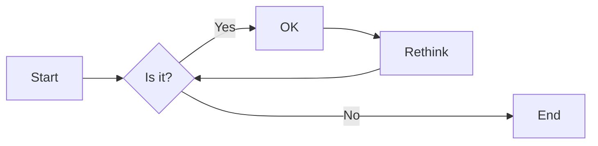
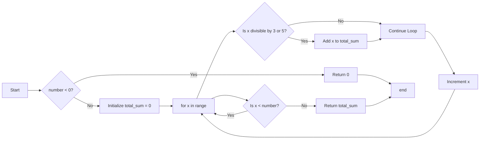
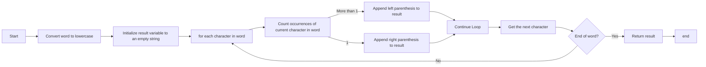
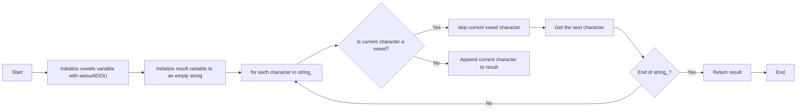

# 实验三 Python列表

班级： 21计科4班

学号： B20210302426

姓名： 陈佩儿

Github地址：<https://github.com/shaliey/python_course>

CodeWars地址：<https://www.codewars.com/users/shaliey>

---

## 实验目的

1. 学习Python的简单使用和列表操作
2. 学习Python中的if语句

## 实验环境

1. Git
2. Python 3.10
3. VSCode
4. VSCode插件

## 实验内容和步骤

### 第一部分

Python列表操作

完成教材《Python编程从入门到实践》下列章节的练习：

- 第3章 列表简介
- 第4章 操作列表
- 第5章 if语句

---

### 第二部分

在[Codewars网站](https://www.codewars.com)注册账号，完成下列Kata挑战：

---

#### 第一题：3和5的倍数（Multiples of 3 or 5）

难度： 6kyu

如果我们列出所有低于 10 的 3 或 5 倍数的自然数，我们得到 3、5、6 和 9。这些数的总和为 23. 完成一个函数，使其返回小于某个整数的所有是3 或 5 的倍数的数的总和。此外，如果数字为负数，则返回 0。

注意：如果一个数同时是3和5的倍数，应该只被算一次。

**提示：首先使用列表解析得到一个列表，元素全部是3或者5的倍数。
使用sum函数可以获取这个列表所有元素的和.**

代码提交地址：
<https://www.codewars.com/kata/514b92a657cdc65150000006>

---

#### 第二题： 重复字符的编码器（Duplicate Encoder）

难度： 6kyu

本练习的目的是将一个字符串转换为一个新的字符串，如果新字符串中的每个字符在原字符串中只出现一次，则为"("，如果该字符在原字符串中出现多次，则为")"。在判断一个字符是否是重复的时候，请忽略大写字母。

例如:

```python
"din"      =>  "((("
"recede"   =>  "()()()"
"Success"  =>  ")())())"
"(( @"     =>  "))(("
```

代码提交地址:
<https://www.codewars.com/kata/54b42f9314d9229fd6000d9c>

---

#### 第三题：括号匹配（Valid Braces）

难度：6kyu

写一个函数，接收一串括号，并确定括号的顺序是否有效。如果字符串是有效的，它应该返回True，如果是无效的，它应该返回False。
例如：

```python
"(){}[]" => True 
"([{}])" => True
 "(}" => False
 "[(])" => False 
"[({})](]" => False
```

**提示：
python中没有内置堆栈数据结构，可以直接使用`list`来作为堆栈，其中`append`方法用于入栈，`pop`方法可以出栈。**

代码提交地址
<https://www.codewars.com/kata/5277c8a221e209d3f6000b56>

---

#### 第四题： 从随机三元组中恢复秘密字符串(Recover a secret string from random triplets)

难度： 4kyu

有一个不为你所知的秘密字符串。给出一个随机三个字母的组合的集合，恢复原来的字符串。

这里的三个字母的组合被定义为三个字母的序列，每个字母在给定的字符串中出现在下一个字母之前。"whi "是字符串 "whatisup "的一个三个字母的组合。

作为一种简化，你可以假设没有一个字母在秘密字符串中出现超过一次。

对于给你的三个字母的组合，除了它们是有效的三个字母的组合以及它们包含足够的信息来推导出原始字符串之外，你可以不做任何假设。特别是，这意味着秘密字符串永远不会包含不出现在给你的三个字母的组合中的字母。

测试用例：

```python
secret = "whatisup"
triplets = [
  ['t','u','p'],
  ['w','h','i'],
  ['t','s','u'],
  ['a','t','s'],
  ['h','a','p'],
  ['t','i','s'],
  ['w','h','s']
]
test.assert_equals(recoverSecret(triplets), secret)
```

代码提交地址：
<https://www.codewars.com/kata/53f40dff5f9d31b813000774/train/python>

提示：

- 利用集合去掉`triplets`中的重复字母，得到字母集合`letters`，最后的`secret`应该由集合中的字母组成，`secret`长度也等于该集合。

```python
letters = {letter for triplet in triplets for letter in triplet }
length = len(letters)
```

- 创建函数`check_first_letter(triplets, first_letter)`，检测一个字母是不是secret的首字母，返回True或者False。
- 创建函数`remove_first_letter(triplets, first_letter)`,  从三元组中去掉首字母，返回新的三元组。
- 遍历字母集合letters，利用上面2个函数得到最后的结果`secret`。

---

#### 第五题： 去掉喷子的元音（Disemvowel Trolls）

难度： 7kyu

喷子正在攻击你的评论区!
处理这种情况的一个常见方法是删除喷子评论中的所有元音(字母：a,e,i,o,u)，以消除威胁。
你的任务是写一个函数，接收一个字符串并返回一个去除所有元音的新字符串。
例如，字符串 "This website is for losers LOL!"   将变成 "Ths wbst s fr lsrs LL!".

注意：对于这个Kata来说，y不被认为是元音。
代码提交地址：
<https://www.codewars.com/kata/52fba66badcd10859f00097e>

提示：

- 首先使用列表解析得到一个列表，列表中所有不是元音的字母。
- 使用字符串的join方法连结列表中所有的字母，例如：

```python
last_name = "lovelace"
letters = [letter for letter in last_name ]
print(letters) # ['l', 'o', 'v', 'e', 'l', 'a', 'c', 'e']
name = ''.join(letters) # name = "lovelace"
```

---

### 第三部分

使用Mermaid绘制程序流程图

安装VSCode插件：

- Markdown Preview Mermaid Support
- Mermaid Markdown Syntax Highlighting

使用Markdown语法绘制你的程序绘制程序流程图（至少一个），Markdown代码如下：


显示效果如下：



查看Mermaid流程图语法-->[点击这里](https://mermaid.js.org/syntax/flowchart.html)

使用Markdown编辑器（例如VScode）编写本次实验的实验报告，包括[实验过程与结果](#实验过程与结果)、[实验考查](#实验考查)和[实验总结](#实验总结)，并将其导出为 **PDF格式** 来提交。

## 实验过程与结果

请将实验过程与结果放在这里，包括：

- [第二部分 Codewars Kata挑战](#第二部分)
#### 第一题：3和5的倍数（Multiples of 3 or 5）

```python
def solution(number):
    if number < 0:
        return 0
    
    total_sum = 0
    
    for x in range(number):
        if x % 3 == 0 or x % 5 == 0:
            total_sum += x
    
    return total_sum
```
---

#### 第二题： 重复字符的编码器（Duplicate Encoder）
```python
def duplicate_encode(word):
    word = word.lower()  # 将字符串转换为小写，以忽略大小写
    result = ""
    
    for char in word:
        if word.count(char) > 1:
            result += ")"
        else:
            result += "("
    
    return result
```
---

#### 第三题：括号匹配（Valid Braces）

```python
def validBraces(string):
    while '()' in string or '[]' in string or '{}' in string:
        string = string.replace('()','')
        string = string.replace('[]','')
        string = string.replace('{}','')
    return string == ''
```
---

#### 第四题： 从随机三元组中恢复秘密字符串(Recover a secret string from random triplets)
```python
def recoverSecret(triplets):
    r = list({i for t in triplets for i in t})
    for t in triplets*2:
        fix(r, t[1], t[2])
        fix(r, t[0], t[1])
    return ''.join(r)
      
def fix(t, a, b):
    if t.index(a) > t.index(b):
       t.remove(a)
       t.insert(t.index(b), a)
```

---

#### 第五题： 去掉喷子的元音（Disemvowel Trolls）
```python
def disemvowel(string_):
    vowels = "aeiouAEIOU"
    result = ""
    
    for char in string_:
        if char not in vowels:
            result += char
    
    return result
```
```python
def disemvowel(string_):
    vowels = "aeiouAEIOU"
    return "".join([char for char in string_ if char not in vowels])

```
- [第三部分 使用Mermaid绘制程序流程图](#第三部分)
#### 第一题：3和5的倍数（Multiples of 3 or 5）

---
#### 第二题： 重复字符的编码器（Duplicate Encoder）

#### 第五题： 去掉喷子的元音（Disemvowel Trolls）


## 实验考查

请使用自己的语言并使用尽量简短代码示例回答下面的问题，这些问题将在实验检查时用于提问和答辩以及实际的操作。

1. Python中的列表可以进行以下操作：
   - 添加元素：使用`append()`方法将元素添加到列表末尾，或使用`insert()`方法在指定位置插入元素。
   - 移除元素：使用`remove()`方法根据元素的值来移除元素，或使用`pop()`方法根据索引来移除元素。
   - 访问元素：使用索引访问列表中的元素，也支持切片操作。
   - 修改元素：通过索引赋值来修改列表中的元素。
   - 长度和迭代：使用`len()`函数获取列表的长度，可以使用`for`循环迭代列表中的元素。
   - 列表合并：使用`+`运算符或`extend()`方法将两个列表合并。
   - 查找元素：使用`in`关键字检查元素是否在列表中。
   - 排序和反转：使用`sort()`方法对列表进行排序，使用`reverse()`方法反转列表。

2. Python中对列表进行排序的两种方法是：
   - 使用`sort()`方法：该方法会就地对列表进行排序，改变原始列表，无需创建新的列表对象。
   - 使用`sorted()`函数：该函数返回一个新的排序后的列表，不改变原始列表。

   主要区别在于`sort()`方法是原地排序，会修改原列表，而`sorted()`函数会返回一个新的已排序列表，不会改变原列表。

3. 要逆序打印Python列表，可以使用切片的方式：
   ```python
   my_list = [1, 2, 3, 4, 5]
   reversed_list = my_list[::-1]
   print(reversed_list)
   ```

4. Python列表在访问元素和迭代时效率较高，因为可以通过索引直接访问元素，并且支持快速的迭代操作。添加元素到列表末尾（使用`append()`方法）也是高效的操作。

   但是，从列表中删除元素（使用`remove()`或`pop()`方法）的效率较低，特别是从列表开头删除元素，因为需要移动后续元素的位置。另外，插入元素到列表中间（使用`insert()`方法）的效率也较低，因为同样需要移动后续元素。如果需要高效的插入和删除操作，可以考虑使用双向链表等数据结构来替代列表。

5. 在《Fluent Python》Chapter 2. An Array of Sequence - Tuples Are Not Just Immutable Lists小节中，主要内容总结如下：
   - Python中的序列是一种通用的数据结构，包括字符串、列表和元组。
   - 列表是一种可变的序列，可以动态添加、修改和删除元素。
   - 元组是一种不可变的序列，一旦创建就不能修改。
   - 序列可以通过切片、迭代和内置函数来操作和处理。
   - 元组可以用于作为字典的键，而列表不能。
   - 列表和元组可以包含混合类型的元素。
   - 列表推导式和生成器表达式是用于创建新列表和生成器的强大工具。
   - 序列的比较和排序是基于元素的比较，因此需要注意元素的比较规则。
## 实验总结

总结一下这次实验你学习和使用到的知识，例如：编程工具的使用、数据结构、程序语言的语法、算法、编程技巧、编程思想。

1. **Python编程语言**：我使用Python来解决编程问题，包括括号匹配、列表操作等。我还学习了Python的列表、字符串、条件语句、循环、函数等基本语法和特性。

2. **数据结构**：我了解了Python中的列表（list）和元组（tuple）这两种序列类型，以及它们的特性和用法。同时，我也探讨了列表的可变性和元组的不可变性。

3. **编程技巧**：我学习了一些Python编程的技巧，包括使用堆栈模拟数据结构、字符串操作来解决问题，以及逆序打印列表等技巧。

4. **编程思想**：我了解了不同的编程思想，如堆栈思想用于括号匹配，以及通过字符串替换来简化算法的思想。这有助于我更好地解决编程问题。

5. **阅读技能**：我阅读了《Fluent Python》的相关内容，学习了序列的基本概念、列表和元组的特性，以及列表推导式和生成器表达式等高级编程技巧。
